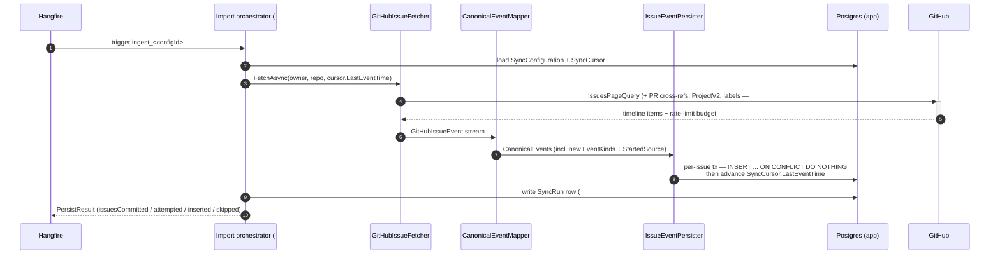
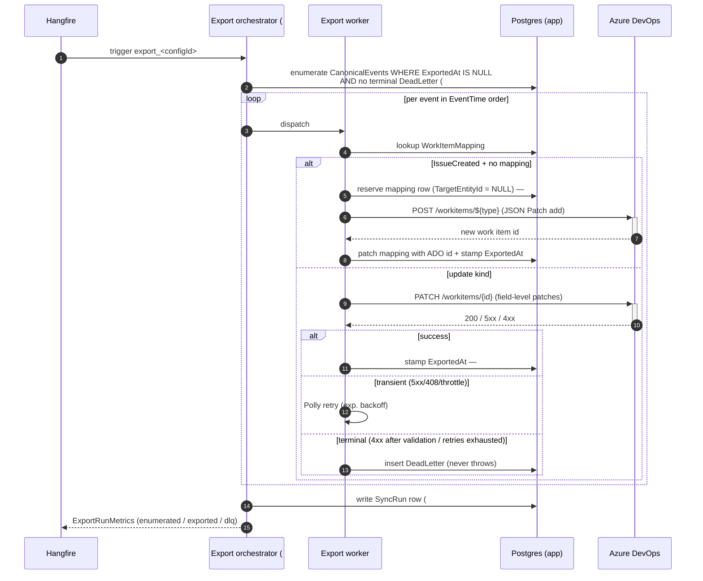

# Runtime overview (post-epics)

What the system looks like once epics **#3 (ingestion MVP)**, **#6 (ADO exporter MVP)**, and **#67 (flow-analytics fidelity)** are complete. Epic #66 is the rolling code-quality bucket and doesn't change runtime topology.

**The two flows are independent.** Import and export each run as their own Hangfire recurring job with their own cron schedule and per-config concurrency. They share the database — that's the only coupling. Either flow can be shipped, deployed, observed, and operated without the other.

> Note: #3's three child issues (#11/#12/#13) are already merged on `main`. The wiring to make import actually run is filed as **#70** (orchestrator + `SyncRun` history, subsumes #58) and **#71** (seed one demo `SyncConfiguration`). The matching export-side orchestrator is **#72**. The classic exporter pieces (#14, #15, #20, #21) and the #5 spike remain open under epic #6.

## Runtime topology

```mermaid
flowchart TB
    subgraph Lightsail["Lightsail Windows + IIS"]
        API["GithubSync.Api host"]
        HF["Hangfire scheduler<br/>(Postgres backend)"]
        UI["/hangfire dashboard<br/>(auth-filtered)"]
        HC["/healthz, /ready<br/>+ Sentry"]
        API --- HF
        API --- UI
        API --- HC
    end

    subgraph DB[("Postgres")]
        APP[(app schema)]
        HFSCH[(hangfire schema)]
    end

    HF -- "every 15 min,<br/>per SyncConfig where Source=GitHub" --> IORCH
    HF -- "every 5 min,<br/>per SyncConfig where TargetSystem=AzureDevOps" --> EORCH
    IORCH["Import orchestrator<br/>(#70)"] --> IMP["Importer<br/>(epics #3, #67)"]
    EORCH["Export orchestrator<br/>(#72)"] --> EXP["Exporter<br/>(epic #6: #14/#15/#20/#21)"]

    IMP -- "GraphQL v4 +<br/>ETag conditional" --> GH[("GitHub")]
    EXP -- "REST + JSON Patch" --> ADO[("Azure DevOps")]

    IMP <--> APP
    EXP <--> APP
    HF <--> HFSCH
```

The two orchestrators are independent Hangfire recurring jobs. No control-flow path connects them — the only thing they share is the Postgres `app` schema. The exporter discovers work by querying `CanonicalEvent`s with `ExportedAt IS NULL` (the marker from #20); whether those rows were just inserted by the importer or were already there from a prior import tick is invisible to the exporter.

## One import tick



## One export tick



The two ticks above are independent. An import tick can run while an export tick is mid-batch; both touch the database but never serialise against each other. Per-config concurrency (no two import ticks for the same `SyncConfiguration` overlapping, no two export ticks for the same `SyncConfiguration` overlapping) is enforced by Hangfire's `[DisableConcurrentExecution]` filter on each job key.

## Data model

```mermaid
erDiagram
    SyncConfiguration ||--|| SyncCursor : has
    SyncConfiguration ||--o{ SyncRun : "run history (#70)"
    SyncConfiguration ||--o{ CanonicalEvent : produces
    SyncConfiguration ||--o{ WorkItemMapping : owns
    CanonicalEvent }o--|| CanonicalActor : "actor (nullable)"
    CanonicalEvent ||--o{ DeadLetter : "terminal failures"
    CanonicalActor ||--o| IdentityMapping : "per TargetSystem"
    TargetUser ||..|{ IdentityMapping : "pool for least-loaded"

    SyncConfiguration {
        guid Id PK
        enum Source
        jsonb SourceLocator
        enum TargetSystem
        jsonb TargetLocator
        jsonb TargetTypeMapping
        jsonb StartedSignalConfig "added by #67"
        bool Enabled
    }
    SyncCursor {
        timestamptz LastEventTime
        string LastETag
        string_note "LastRun* scalars dropped by #70 — see SyncRun"
    }
    SyncRun {
        guid Id PK
        enum Source
        enum Flow "Import or Export (open decision in #72)"
        timestamptz StartedAt
        timestamptz CompletedAt
        enum Status "Success / Partial / Failed"
        int IssuesCommitted
        int EventsAttempted
        int EventsInserted
        int EventsSkippedUnknownKind
        long DurationMs
        string Message
    }
    CanonicalEvent {
        guid Id PK
        enum EventKind "v1 + PR/Status/Label additions (#67)"
        timestamptz EventTime
        string SourceEventId
        jsonb PayloadJson "incl. StartedSource"
        timestamptz IngestedAt
        timestamptz ExportedAt "added by #20"
    }
    WorkItemMapping {
        string SourceEntityId
        string TargetEntityId "nullable while reserved — #21"
        string TargetWorkItemType "locked on create"
    }
    DeadLetter {
        int AttemptCount
        string Reason
        jsonb RawResponse
        bool Resolved
    }
```

## What each epic contributes

| Epic | Flow | What lands |
|---|---|---|
| **#3** GitHub ingestion MVP | Import | GraphQL fetcher, mapper, idempotent persister, cursor advancement — **already merged**. Orchestrator wiring + `SyncRun` history lands in **#70**; first demo `SyncConfiguration` seed lands in **#71**. Together those two close the epic. |
| **#6** ADO exporter MVP | Export | Enumerate unprocessed events → JSON Patch to ADO; per-event `ExportedAt` (#20), reservation-pattern create (#21), Polly retry + `DeadLetter` (#15). Orchestrator wiring lands in **#72** to close the epic. |
| **#67** Flow-analytics fidelity | Import | New `EventKind`s for PR cross-refs, configurable "started" labels, ProjectV2 status; `StartedSource` marker on payload so downstream consumers can derive cycle-time starts. |
| **#66** Codebase quality | — | Rolling bucket; no runtime change. |

## Caveats — assumptions baked in

- **The two flows are designed to ship and operate independently.** A staging/production deploy can run just the import flow (#3 done, exporter dormant) and have a useful system — canonical events accumulate, run metrics are queryable. The export flow can then ship later with no changes to the import code path.
- **#3 treated as not yet closed.** The three child issues (#11/#12/#13) are merged, but the epic only closes once #70 + #71 land and at least one repo ingests on a real Hangfire tick.
- **#20 and #21 are #6 children by parent link** but aren't listed in the epic body. Without them the exporter has no "what's unprocessed?" query (#20) and can orphan ADO work items on crash mid-create (#21).
- **#58 is being subsumed by #70.** The `SyncRun` history table is a child concern of the import orchestrator (the orchestrator is the natural owner of run-level state), so #58's scope folds into the #70 PR. #58 stays open for now; close it on #70 merge.
- **`SyncCursor.LastRun*` scalars get dropped** in #70's migration in favour of full `SyncRun` history. Same information, queryable shape.
- **Per-event export dispatch is the topology.** If #72 lands as a single sequential loop instead of fanout-to-workers, the picture simplifies but the data flow is identical.
- **#67 is import-side only for v1** — captures the signals but doesn't try to replay "status changed" as an ADO board move.
